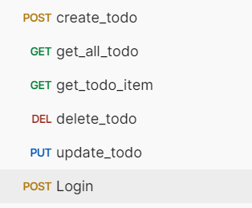

# Todo-List-API

### roadmap.sh backend beginning project
- flask_restful_api
- sqlalchemy
- with user authentication

### project url
https://roadmap.sh/projects/todo-list-api


### postman api


### project structure
```flask_rest_tutorial/
│
├── common/                  # 常用工具函数或配置文件
│   └── __init__.py
│   └── config.py            # 数据库配置文件
│   └── api_tools.py         # token_requied
│   └── constants.py         # Login Secert
│   └── db.py                # create database
|   
│
├── models/                  # 数据库模型
│   └── __init__.py
│   └── todo_model.py        # Todo数据模型
│   └── user_model.py         
│
├── resources/               # 资源 (RESTful API的资源)
│   └── __init__.py
│   └── todo_resource.py     # Todo API资源
│   └── user_resource.py
│
├── routes/                  # 路由
│   └── __init__.py
│   └── todo_routes.py       # 注册Todo相关的路由
│   └── user_routes.py
│
├── services/                # 业务逻辑
│   └── __init__.py
│   └── todo_service.py      # 处理Todo业务逻辑
│   └── user_service.py
│
├── app.py                  # Flask应用主入口
├── requirements.txt         # 依赖包列表
```   

